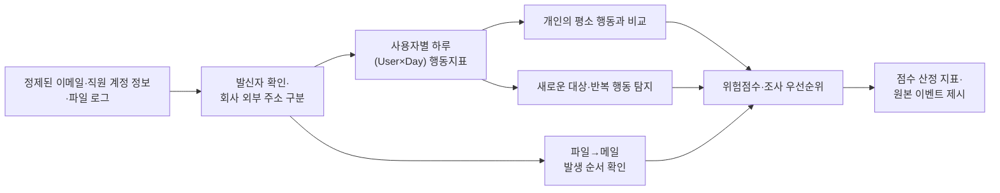

# 1. 프로젝트 개요

## 프로젝트명

**SIEM 로그 기반 이메일 외부 유출 위험 사용자 탐지 및 위험 스코어링**

## 목표 및 범위

본 프로젝트는 이메일 로그와 직원 계정 정보(LDAP)를 활용해 사용자의 평소 행동에서 벗어난 외부 전송을 탐지하고, 위험점수와 조사 우선순위를 제공한다.

| 구분 | 내용 |
|---|---|
| 목표 | 외부 전송 이상징후를 탐지해 조사 대상의 우선순위를 제시한다. |
| 분석 데이터 | 직원 계정 정보(LDAP), 장치, 이메일, 파일, 웹, 로그온, 성격 특성 데이터 |
| 분석 단위 | 사용자별 하루(User×Day) 이메일 활동 |
| 분석 방법 | 사용자의 평소 행동을 기준으로 현재 행동이 얼마나 다른지 계산한다. |
| 결과물 | 위험 사용자 순위, 위험점수, 점수 산정 근거 |
| 해석 범위 | 실제 정보유출자를 확정하지 않고 조사가 필요한 사용자를 선별한다. |
| 확장 범위 | 장치·파일 로그 연계는 추후 검토한다. |

# 2. 추진 배경

## 실제 정보유출 사례

NIA 사례에서는 한 직원이 2022년부터 약 3년간 기관 이메일로 외부 업체 관계자에게 비공개 자료를 380회 전달했다. 반복적인 외부 전송이 장기간 탐지되지 않았다는 점에서 이메일 행동 분석의 필요성을 확인했다. 사례의 세부 내용과 출처는 부록을 참고한다.

## 주제 선정 이유

- 평소와 다른 수신자, 전송량, 첨부파일 사용과 반복 전송을 분석해 정보유출 징후를 조기에 찾을 수 있다.
- 제공된 이메일 로그에는 사용자, 발신자·수신자, 시간, 메시지 크기, 첨부파일, BCC 정보가 있어 사용자별 행동 분석이 가능하다.

# 3. 데이터 분석 근거

본 프로젝트는 이메일·직원 계정 정보(LDAP)·파일 로그를 결합해 **사용자의 평소 행동에서 벗어난 외부 전송과 그 선행 행동을 탐지하고, 조사 우선순위를 제시**한다. 샘플 분석 결과, 외부 전송의 규모·시간·반복성뿐 아니라 파일 활동 이후 외부 첨부메일이 이어지는 복합 패턴도 확인되어 개발 가능성이 충분하다.

## 제공 로그와 핵심 데이터

| 데이터 | 핵심 항목 | 활용 목적 |
|---|---|---|
| 이메일 | 시간, 사용자, PC, 발신·수신 주소, 메시지 크기, 첨부 수 | 외부 수신자·첨부·전송 규모·시간대·새로운 대상 분석 |
| 월별 직원 계정 정보(LDAP) | 사용자(`user`), 회사 이메일, 직무·조직 | 이메일 발신자 확인, 회사 내부·외부 주소 구분 |
| 파일 | 시간, 사용자, PC, 파일명 | 외부메일 전 파일 활동 급증 탐지 |
| 장치·로그온·웹 | 시간, 사용자, PC, 활동·URL | 향후 여러 로그의 발생 순서 분석에 활용 |

각 로그의 전체 항목, 데이터 형식, 연결 방법 및 해석 시 주의사항은 별도의 제공 로그 데이터 상세 부록을 참고한다.

분석에는 다음 기준으로 정제된 데이터를 사용한다.

| 정제 항목 | 적용 기준 |
|---|---|
| 사용자 컬럼명 | 모든 로그의 `user_id`를 `user`로 통일 |
| 날짜·시간 형식 | `MM/DD/YYYY HH:MM:SS`를 ISO 8601 형식인 `YYYY-MM-DDTHH:MM:SS`로 통일 |

분석 대상은 원본 이메일 1,314,400건 중 **이메일 기록의 `user`와 발신 주소가 당시 직원 계정 정보의 `user` 및 회사 이메일과 모두 일치한 815,250건**이다. 이 가운데 외부 수신자가 포함된 이벤트는 136,519건(16.75%)이며, 1,000개 계정의 사용자별 하루(User×Day) 기록 289,783건을 분석했다.

> **외부 발송 후보 = 이메일 기록의 `user`·발신 주소가 직원 계정 정보와 일치 + 회사 외부 수신자 1명 이상**

이는 실제 정보유출 확정 조건이 아니라, 분석 대상을 보수적으로 선별하기 위한 기준이다.

## 개인별 평소 행동과 비교한 분석 결과

사용자마다 평소 업무량이 다르므로 모든 사람에게 같은 기준을 적용하지 않고, **각 사용자의 현재 날짜 이전 최대 30일 기록**과 현재 행동을 비교했다. 이때 일부 매우 큰 값에 결과가 흔들리지 않는 Robust Z-score를 사용했다. 이 값이 클수록 평소보다 외부메일, 첨부, 메시지 크기 또는 수신자 수가 많이 증가했다는 뜻이다. 현재 이후의 기록은 비교 기준에 포함하지 않았다.

| 분석 결과 | 확인 내용 | 개발 적용 |
|---|---|---|
| 과거 기록 확보 | 전체 분석일 중 89.66%는 사용자별 과거 기록이 30일 이상 존재 | 대부분의 기간에서 개인의 평소 행동과 비교 가능 |
| 외부메일 급증 | 일부 사용자·날짜에서 평소보다 외부메일이 크게 증가 | 갑작스러운 외부 전송 증가 탐지 |
| 첨부·크기·수신자 증가 | 일부 사용자·날짜에서 첨부 수, 메시지 크기, 외부 수신자 수가 평소보다 크게 증가 | 전송 자료량과 전달 범위가 함께 증가한 날 탐지 |
| 비근무시간 이상 | 6,761개의 사용자별 하루 기록에서 평소와 다른 시간대 활동 확인 | 단순 야간 여부가 아닌 개인의 평소 시간대와 비교 |
| 파일 활동 급증 | 과거 30일 대비 파일 활동 z≥3인 날 3,907건 | 이메일 전 자료 취급 증가를 선행 신호로 사용 |
| 여러 행동의 연결(Sequence) | 파일 급증 후 외부 첨부메일과 크기 증가 또는 복수 첨부가 이어진 후보 95건·51개 계정 | 단일 이메일보다 구체적인 우선 조사 대상 제시 |

위 결과는 행동지표를 이용해 평소와 크게 다른 행동을 구분할 수 있음을 보여준다. 다만 분석 결과만으로 실제 유출을 확정할 수 없으며, 최종 결과는 먼저 확인할 사용자를 정하는 근거로 사용한다.

## 데이터 제약사항

| 제약 | 대응 원칙 |
|---|---|
| 이메일에 발송·수신 구분 항목이 없음 | 기록된 발신 주소가 해당 직원의 회사 이메일과 일치할 때만 외부 발송 후보로 사용 |
| 메시지 크기의 단위와 첨부 포함 여부가 불명확 | 절대 전송량이 아닌 사용자의 과거 행동 대비 변화로 해석 |
| 파일 로그에 작업 종류·크기·복사 방향이 없음 | 파일 활동과 이메일의 시간적 선후관계만 제시하고 인과관계로 단정하지 않음 |
| 근무표·승인 외부 도메인 정보가 없음 | 야간·새로운 대상 신호는 보조 지표로 사용하고 향후 허용목록 반영 |
| 실제 유출 여부를 알려주는 정답 데이터가 없음 | 정확도를 주장하지 않고 사례별 점수 변화와 탐지 근거를 확인 |

# 4. 개발 계획

핵심 개발 방향은 **개인의 평소 행동과 현재 행동을 비교하고 여러 로그의 발생 순서를 연결해, 이해하기 쉬운 위험점수와 근거를 제공하는 것**이다.

## 전체 분석 흐름

분석의 핵심 지표는 ① 평소와 다른 시간대의 활동, ② 외부메일 발송 급증, ③ 외부 첨부·메시지 크기·수신자 증가, ④ 파일 활동 급증이다. 특히 **파일 활동 급증 → 2시간 이내 외부 첨부메일 → 평소보다 큰 메일 또는 첨부 2개 이상**의 흐름을 주요 위험행동 후보로 탐지한다.

## 기술 스택

| 구분 | 기술 | 용도 |
|---|---|---|
| 데이터 저장·조회 | SQLite, CSV | 샘플 로그 조회 및 중간 결과 관리 |
| 데이터 처리·분석 | Python, Pandas, NumPy | 이메일 주소 분리(Parsing), 직원 계정 정보 연결(Join), 사용자별 하루 집계, 발생 순서 분석 |
| 이상행동 분석 | 개인별 과거 비교, 조건 기반 규칙(Rule) | 평소보다 큰 변화, 새로운 대상(Novelty), 반복 행동 탐지 |
| 비교 모델 | Isolation Forest(선택) | 여러 행동이 함께 달라진 사례를 추가 탐색 |
| 결과 제공 | Streamlit 또는 Jupyter | 위험 사용자 순위, 위험점수, 평소 행동 기준 및 탐지 근거 시각화 |
| 협업·문서화 | GitHub, Notion | 코드 버전 관리 및 분석 기준 공유 |

# 6. 역할 분담

3명이 데이터 준비부터 결과 검증까지 병렬로 진행하되, 지표 정의와 위험점수는 공동 검토한다.

| 담당 | 핵심 역할 | 주요 업무 |
|---|---|---|
| A | 기획·검증 | 범위·일정 관리, 분석 기준과 시나리오 검증, 발표자료 통합 |
| B | 데이터·지표 | 이메일·직원 계정 정보 정리, 사용자별 하루 행동지표와 평소 행동 기준 개발 |
| C | 점수·시각화 | 파일→메일 발생 순서 분석, 위험점수·순위 및 결과 화면 구현 |

# 7. 2주간 WBS 개발 일정

| 기간 | 핵심 목표 | 주요 결과물 |
|---|---|---|
| 1주차 | 데이터 정리, 행동지표 생성, 개인별 평소 행동 기준과 탐지 규칙 구현 | 정제 데이터, 사용자별 하루 행동지표, 평소 대비 변화와 규칙 결과 |
| 2주차 | 여러 로그의 발생 순서 분석, 위험점수·화면 구현, 전체 검증과 발표 준비 | 위험 사용자 순위, 탐지 근거 화면, 검증 결과, 발표자료 |

역할별 세부 업무와 10개 작업일의 개인별 일정은 별도의 3인 역할 분담 및 2주 WBS 부록에 정리한다.
